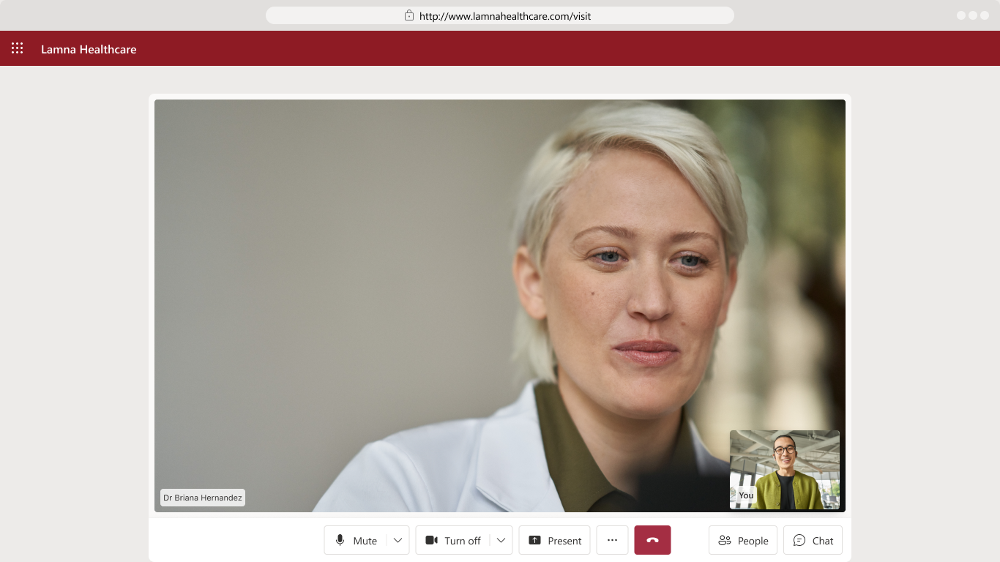

# Azure Communication Services Virtual Appointments

[](https://portal.azure.com/#create/Microsoft.Template/uri/https%3A%2F%2Fraw.githubusercontent.com%2FAzure-Samples%2Fcommunication-services-virtual-visits-js%2Fmain%2Fdeploy%2Feditableazuredeploy.json)

Azure Communication Services Virtual Appointments is a web app you can host to provide your customers with a branded virtual consultation experience.

## Features

- **Rich communications experience**. Includes lobby, calling, and chat experiences for your users. Browser-based and mobile-friendly, users won't need to install any apps.
- **Quick customization** options for colors, themes, and features via a .json config file.
- **Integration with Microsoft Teams**. Let your staff host and join meetings using familiar Teams UI, while the clients join the same call via your custom branded web app using [Teams interoperability](https://docs.microsoft.com/azure/communication-services/concepts/teams-interop).
- **Scheduling powered by Microsoft Bookings**. [Configure Bookings](https://aka.ms/virtual-visits) to allow your clients to schedule appointments and receive join links to your own hosted app. [Learn more about how to configure Microsoft Bookings](./docs/microsoft-bookings.md).
- **Industry.** A virtual appointment template with pre-selected theme color schemes.
- **Post Call Surveys**. Customizable surveys to collect valuable feedback like quality of services or net promoter score after call ends. [Learn more about how to configure post-call surveys](./docs/post-call-survey.md).
- **Open source** and customizable meeting UI controls. The app is built using [Azure Communication Services UI Library](https://azure.github.io/communication-ui-library/) which has many options for customizing layouts, rendering, and behaviors.

## Getting Started

There are two ways to start using this app:

- Use the Azure Communication Services Sample Builder. The Sample Builder is a wizard that lets you quickly make common customization choices, set up Microsoft Bookings integration, and deploy the app to your Azure subscription. See [here](https://aka.ms/virtual-visits) for more information about the Builder.
- Configure and deploy manually. Follow the rest of this readme to learn how to get up and running locally, create a new Azure deployment, or update an existing one.

## Code Structure

- /client: Frontend client.
- /server: Server app.
- /deploy: ARM templates and scripts for quick Azure deployment.
- /server/src/defaultConfig.json : Sample configuration file and schema description. The config file contains customization settings that can be done without changing the app: themes and colors, text captions, and feature toggles.

## Local Setup

### Prerequisites

- Create an Azure account with an active subscription. For details, see [Create an account for free](https://azure.microsoft.com/free/).
- An active Communication Services resource. [Create a Communication Services resource](https://docs.microsoft.com/azure/communication-services/quickstarts/create-communication-resource).
- [Node.js (14.19.0 and above)](https://nodejs.org/en/download/)

### Install Dependencies

- Run `npm i` from both the `/client` and `/server` folders to install the dependencies for each project.

```
cd client
npm i

cd server
npm i
```

### Build and Run

Development mode:

- You can run the server and client separately, or run the whole project together in development mode.
- Hot reload is enabled for both methods (webpackdevserver for client and ts-node-dev for server).
- The client will be running on port 3000 and the server will be running on port 8080.
- Use the client port 3000 to access the different routes. For example, `localhost:3000/book` and `localhost:3000/visit`
- Use the server port 8080 to access server APIs.
- To run the entire project together, use the following commands.

```
cd client
npm run build:project
npm run start:project
```

- You can also `build` and `start` the server and client components separately by running the `build` and `start` commands appended with `client` and `server`.
- For server individual launch, there won't be access to client routes, but you can still access the server APIs like /config. To build and start the server individually, use the following commands.

```
cd server
npm run build:server
npm run start:server
```

- For client individual launch, if the server is not running, access to client routes is limited. To build and start the client individually, use the following commands.

```
cd client
npm run build:client
npm run start:client
```

Production mode:

- This runs the client and server as a single application.
- Unlike development mode, the server will serve both the routes and the server APIs.
- The server will be running on port 8080. For example, localhost:8080/book and localhost:8080/visit.
- The built files will be put in the location `YOUR_REPO_ROOT/dist` and the server will be started from this location.

```
npm run package
npm run start:prod
```

### Environment Variables

Where do I set this?

- The variables used in the config can be set as environment variables in your system.
- The server retrieves the config to use from the system environment variables. On local machines you'll have to set this up manually. For deploy to Azure button, the ARM template will set this up for you.
- The environment variables currently used in the config are:

  - `VV_COMMUNICATION_SERVICES_CONNECTION_STRING`. [Learn more about how to access your Azure Communication Services connection string.](https://docs.microsoft.com/azure/communication-services/quickstarts/create-communication-resource?tabs=windows&pivots=platform-azp#access-your-connection-strings-and-service-endpoints) Example value: "endpoint=https://test.westus.communications.azure.com/;accesskey=SAMPLEKEY1234"
  - `VV_MICROSOFT_BOOKINGS_URL`. Example value: "https://microsoftbookings.azurewebsites.net/?organization=financialservices&UICulture=en-US". [Learn more about how to configure Microsoft Bookings](./docs/microsoft-bookings.md).
  - `VV_CHAT_ENABLED`. Example value: "true".
  - `VV_SCREENSHARE_ENABLED`. Example value: "true".
  - `VV_COMPANY_NAME`. Example value: "Lamna Healthcare".
  - `VV_COLOR_PALETTE`. Example value: "#0078d4".
  - `VV_WAITING_TITLE`. Example value: "Thank you for choosing Lamna Healthcare".
  - `VV_WAITING_SUBTITLE`. Example value: "Your clinician is joining the meeting".
  - `VV_LOGO_URL`. Example value: "https://your_cdn/logo.png".
  - `VV_POSTCALL_SURVEY_TYPE`. The types currently supported are "onequestionpoll", "msforms" and "custom". [Learn more about how to configure post-call surveys](./docs/post-call-survey.md)
  - `VV_POSTCALL_SURVEY_OPTIONS_SURVEYURL`. Survey URL if post call survey type is "msforms" or "custom". Example value: "https://your_survey_service/survey".
  - `VV_POSTCALL_SURVEY_ONEQUESTIONPOLL_TITLE`. Example value: "Tell us how we did".
  - `VV_POSTCALL_SURVEY_ONEQUESTIONPOLL_PROMPT`. Example value: "How satisfied are you with this virtual appointment's audio and video quality?".
  - `VV_POSTCALL_SURVEY_ONEQUESTIONPOLL_TYPE`. The types currently supported are "likeOrDislike", "rating" or "text".
  - `VV_POSTCALL_SURVEY_ONEQUESTIONPOLL_ANSWER_PLACEHOLDER`. AnswerPlaceholder when one question poll type is "text". Example value: "Tell us why!".
  - `VV_POSTCALL_SURVEY_ONEQUESTIONPOLL_SAVE_BUTTON_TEXT`. Example value: "Continue".
  - `VV_COSMOS_DB_CONNECTION_STRING`. Connection string of your cosmos DB account.
  - `VV_COSMOS_DB_NAME`. Name of the Cosmos Database.

- In addition to setting these values as system environment variables, you can set them in the defaultConfig.json file in the `/server/src` folder. In this case the environment value will take precedence.
- The environment variables currently used in the defaultConfig.json are:
  - `communicationServicesConnectionString`. [Learn more about how to access your Azure Communication Services connection string.](https://docs.microsoft.com/azure/communication-services/quickstarts/create-communication-resource?tabs=windows&pivots=platform-azp#access-your-connection-strings-and-service-endpoints) Example value: "endpoint=https://test.westus.communications.azure.com/;accesskey=SAMPLEKEY1234"
  - `microsoftBookingsUrl`. Example value: "https://microsoftbookings.azurewebsites.net/?organization=financialservices&UICulture=en-US". [Learn more about how to configure Microsoft Bookings](./docs/microsoft-bookings.md).
  - `chatEnabled`. Example value: "true".
  - `screenShareEnabled`. Example value: "true".
  - `companyName`. Example value: "Lamna Healthcare".
  - `colorPalette`. Example value: "#0078d4".
  - `waitingTitle`. Example value: "Thank you for choosing Lamna Healthcare".
  - `waitingSubtitle`. Example value: "Your clinician is joining the meeting".
  - `logoUrl`. Example value: "https://your_cdn/logo.png".
  - `postCall`. [Learn more about how to configure post-call surveys](./docs/post-call-survey.md)
  - `cosmosDb`. [Learn more about how to access Cosmos DB](./docs/post-call-survey.md#databaseConfiguration)

### End to End tests

[Learn more about how to run end to end tests](https://github.com/Azure-Samples/communication-services-virtual-visits-js/tree/main/e2e-tests#automation-tests-for-azure-communication-services-virtual-visits)

## Updating Your Sample

Once a new release is published in this repo, you can update your deployed app
with the latest package using [Azure CLI](https://docs.microsoft.com/cli/azure/webapp/deployment/source?view=azure-cli-latest#az_webapp_deployment_source_config_zip).

For example:

- Download new `sample.zip`
- Deploy using Azure CLI:

  ```shell
  az webapp deployment source config-zip --resource-group <group-name> --name <app-name> --src <path-to-release.zip>
  ```

You can also deploy the same release package using the [Kudu service](https://github.com/projectkudu/kudu/wiki) UI or REST API, see [Deploy ZIP or WAR](https://docs.microsoft.com/azure/app-service/deploy-zip) for details.

## Trademark

**Trademarks** This project may contain trademarks or logos for projects, products, or services. Authorized use of Microsoft trademarks or logos is subject to and must follow [Microsoft’s Trademark & Brand Guidelines](https://www.microsoft.com/legal/intellectualproperty/trademarks/usage/general). Use of Microsoft trademarks or logos in modified versions of this project must not cause confusion or imply Microsoft sponsorship. Any use of third-party trademarks or logos are subject to those third-party’s policies.

## License

[MIT](LICENSE.md)
