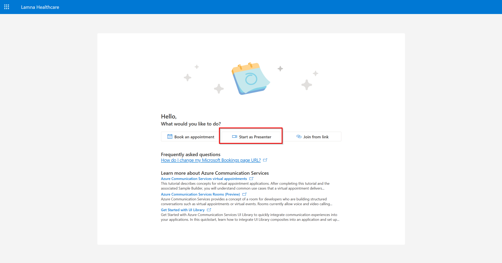

# Virtual Appointment using Azure Communication Services Rooms

If you do not have access to Microsoft Bookings and Microsoft Teams, you can use [Azure Communication Services Rooms](https://learn.microsoft.com/en-us/azure/communication-services/concepts/rooms/room-concept) to start a call and try out the calling experience via the UI Library.

- [Use Rooms to start an appointment now](#start-now)
- [Use Rooms to schedule an appointment for later](#in-app-scheduler)

## <a id="start-now">Use Rooms to start an appointment now</a>

To start a call now, navigate to the Sample's home page and click on the "Start as Presenter" button. Starting a call now will create a new Room with two participants: a Presenter (representing the professional in the appointment) and an Attendee (representing the end-user).

You are automatically joined into the call as the Presenter. As the Presenter, you can copy the invite link for the Attendee in the People pane:

To join as the Attendee, paste the invite link into a different browser window.

[Learn more about roles and permissions in Rooms.](https://learn.microsoft.com/en-us/azure/communication-services/concepts/rooms/room-concept#predefined-participant-roles-and-permissions)
