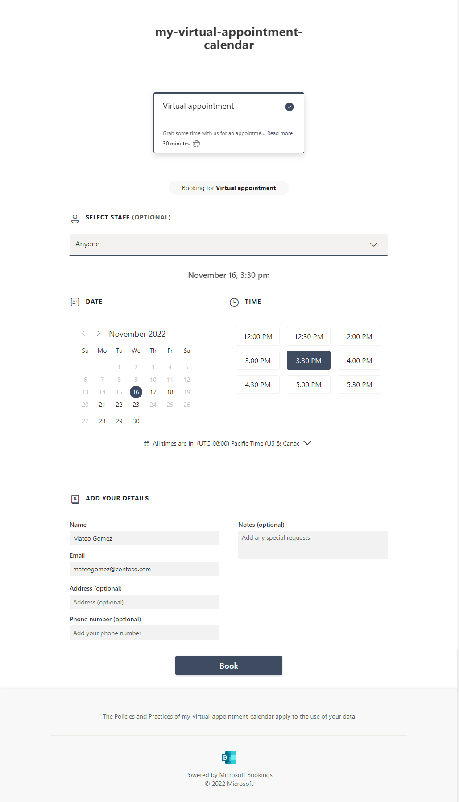
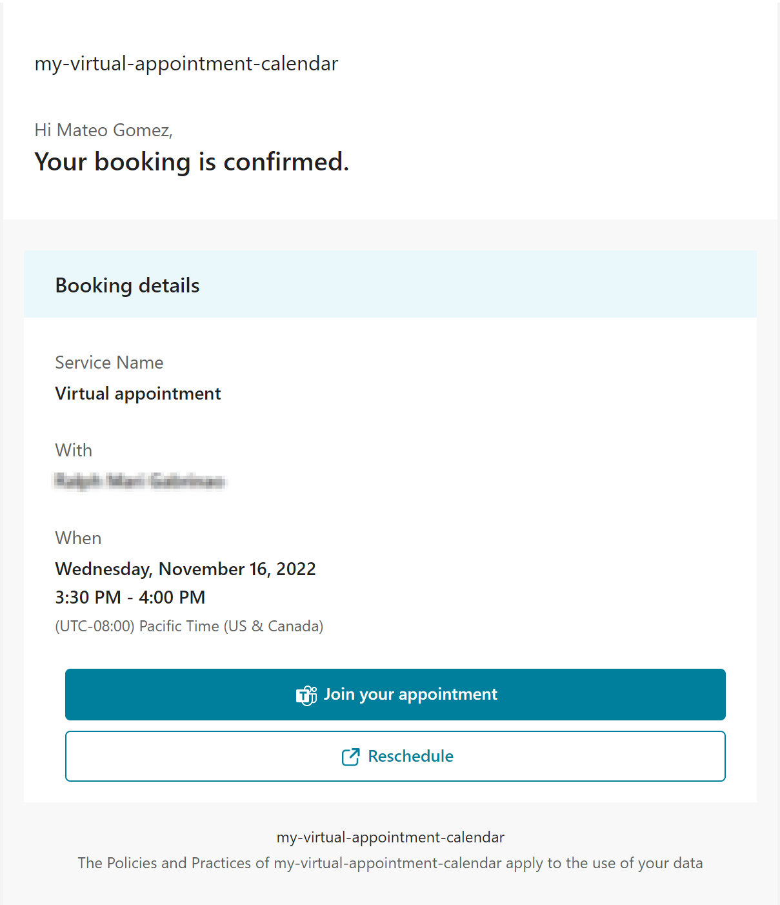
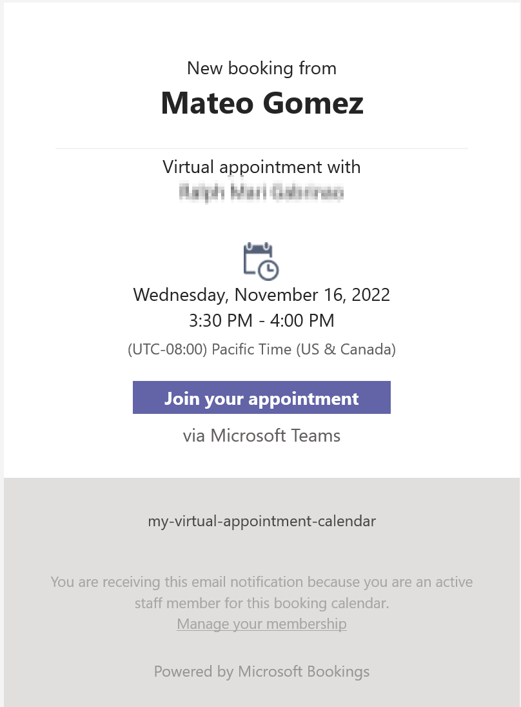

# How to Configure Microsoft Bookings

This sample takes advantage of the Microsoft 365 Bookings app to power the consumer scheduling experience and create meetings for providers. Follow the steps below to create a Microsoft Bookings calendar and use it in the sample.

### Steps

- [Create a Microsoft Bookings Calendar](#bookingscalendar)
- [Set the Microsoft Bookings URL in the Sample](#bookingsurl)
- [Integrate the Sample in Microsoft Bookings](#bookingssampleintegration)
- [Make an appointment in the Sample](#sampleappointment)

## <a id="bookingscalendar">Create a Microsoft Bookings Calendar</a>

Go to https://outlook.office.com/bookings/homepage to create a Microsoft Bookings calendar.


Ensure the `Make this a Teams meeting` setting is enabled.


Ensure the bookings page is publicly accessible.


Click `Create calendar`.

## <a id="bookingsurl">Set the Microsoft Bookings URL in the Sample</a>

Copy the Microsoft Bookings URL from your Bookings calendar.


### Configure using environment variables

```
VV_MICROSOFT_BOOKINGS_URL = "Your Bookings URL"
```

If your app is hosted in Azure App Service, you can set environment variables in the App Service's Application Settings. [Learn more about Azure App Service Application Settings.](https://learn.microsoft.com/azure/app-service/configure-common?tabs=portal)

### Configure using defaultConfig.json

```
{
    ...
    "microsoftBookingsUrl": "Your Bookings URL"
    ...
}
```

## <a id="bookingssampleintegration">Integrate the Sample in Microsoft Bookings</a>

End-users want to jump directly to the virtual appointment from the email reminder they receive from Bookings. In Bookings, you can provide your app's URL which will be used in reminders.

Once you have deployed the Sample to Azure App Service, copy the App's URL.


In Bookings, paste the App Service URL suffixed with `/visit`


Click `Save`.

## <a id="sampleappointment">Make an appointment in the Sample</a>

Go to the `/book` page in your Sample where your public Bookings page is rendered, and make an appointment.



Click `Book`.

As an end-user, you will receive an email confirming the appointment. Click the `Join your appointment` button to join the appointment and start the call using Azure Communication Services.



As a professional, you will also receive an email confirming the end-user's appointment. Join the appointment through Teams.



You have successfully integrated the Virtual Appointment Sample and Microsoft Bookings! With Microsoft Bookings, end-users are able to schedule appointments, receive email reminders, and join appointments through Azure Communcation Services directly from the email reminders. Professionals also receive email reminders, and they can join appointments through Microsoft Teams.
